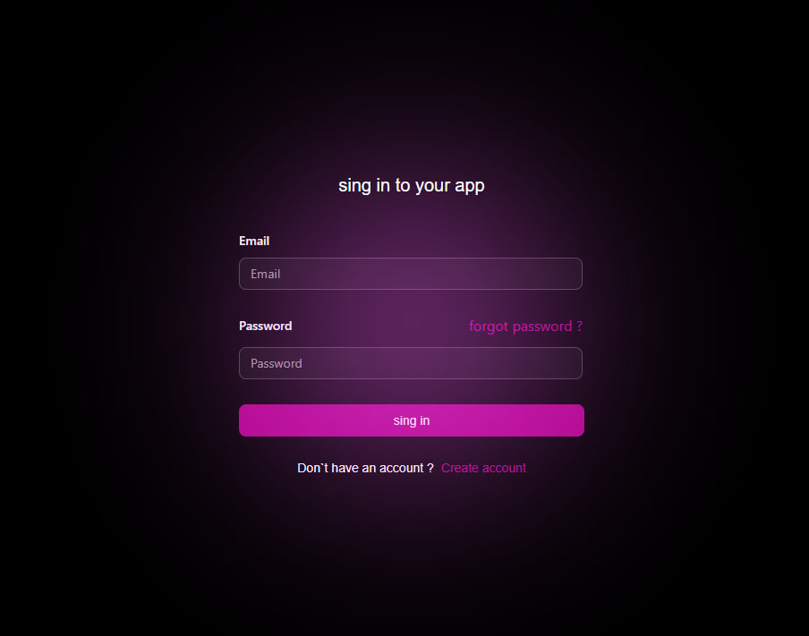

This is a Next.js and tauri project.

## Getting Started

First, run the development web version:

```bash
# for web (first)
bun dev
# for tauri (second)
bun tauri dev
```

Open [http://localhost:3000](http://localhost:3000) with your browser or wait for tauri compilling u app and see the result.

Authorization [](./src/modules/authorization/)
